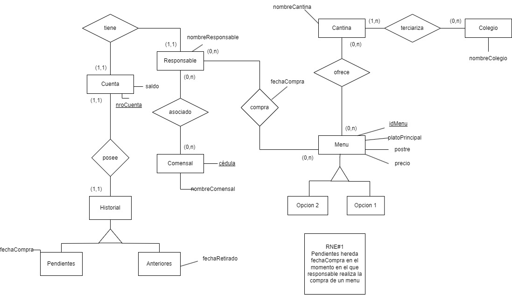

# Informe entrega 1
## Repositorio Git

Para la realizacion de este proyecto, nuestro equipo trabajó con la herramienta de versionado git.   
A continuacion se enlistarán los comandos que utilizamos:   
-git clone: para copiar el repositorio remoto   
-git pull: para traer el nuevo contenido del repositorio remoto al repositorio local   
-git push: para cargar  el nuevo contenido del repositorio local al repositorio remoto   
-git add: para agregar un archivo modificado al área de staging   
  /-> Decidimos no utilizar el prefijo "." para solo salvar los archivos individuales en los que estamos trabajando  
-git commit: para guardar los cambios realizados en el repositorio local   
-git branch: para crear la rama develop, y verificar las ramas existentes   
-git checkout/switch: para realizar movimientos entre las ramas   
-git status: para verificar el estado de los archivos e informacion adicional (por ejemplo en que rama estemos ubicados)  
-git log: para chequear el listado de commits y toda su informacion  
-git merge: para fusionar los cambios de una rama a la otra  

##  Versionado
Nuestro equipo decidió utilizar ciertos estándares para facilitar la organizacion del proyecto.   
A continuación un listado con los mismos:    
-IDE: Visual Studio Code.   
-La evaluacion de los avances del proyecto se realizaran cuando todo el equipo este reunido en llamada, y la ralizacion de los commits cuando consideremos que el contenido desarrollado este suficientemente consolidado     
-Utilizaremos dos ramas para el desarrollo del proyecto, la rama "main" y una adicional llamada "develop" para trabajar con los cambios potenciales en paralelo. Para esta primera entrega optamos por realizar un merge de ambas ramas al inicio del proyecto y al final del mismo.    
-Los mensajes de los commits utilizarán una serie de prefijos y tendrán el siguiente formato:   
    git commit -m "*Prefijo*: Descripcion del cambio + *Subtitulo de la entrega 1*"   
    Prefijos:   
        -docs: Cambios en la documentación   
        -refactor: Se realizó un pequeño cambio en el documento/código  
        (se ignorara el uso de *Subtitulo de la entrega* al hacer este tipo de commit)   
        -feat: Característica nueva para el usuario   
        -fix: Se arregló un bug   
        -test: Se añadió un test   
        -code: Se agrego codigo en <nombre.tipo>

Este es el resumen de commits de la entrega final.

---

---

## Elicitación
Las distitntas técnicas de elicitacion que usamos para la definición de los requerimientos de nuestro problema fueron: entrevista, cuestionario, user personas y distintas referencias que hallamos relevantes en la web.  
Decidimos incluir los links y preguntas correspondientes que utilizamos en un apartado llamado anexos, para una mayor claridad. Dichos anexos [se encuentran en un archivo llamado "Anexos.md"](Anexos.md) en [la carpeta docs.](../docs)   
-Preguntas entrevistas - Anexo 1    
-Cuestionario - Anexo 2   
-Referencias de internet- Anexo 3   
-Respuestas de entrevista- Anexo 4  

### Referencias de internet 
Las primeras fuentes que decidimos consultar para interiorizarnos en el problema, fueron las diferentes páginas de los colegios privados más importantes en Montevideo. Algunos patrones se repetían en la gran mayoría de los colegios. Habían disponibles distintos métodos para consultar el **menú** de la semana, Whatsapp, pdf colgado en la página del colegio y la aplicacion "OrderEat".    
A continuación una tabla con los colegios y su forma de brindar el servicio (X indica servicio disponible):   

| Colegio         | Whatsapp     |     PDF    |   OrderEat   |
|-----------------|--------------|------------|--------------|
|La Mennais       |      X       |      -     |       X      | 
|IvyThomas        |      -       |      -     |       X      |
|Seminario        |      -       |      X     |       X      |
|Inst.Uru-Arg     |      -       |      -     |       X      |
|St. Patrick’s    |      -       |      -     |       X      |
|British Schools  |      -       |      X     |       -      |
|Colegio Ingles   |      -       |      X     |       -      |
|Colegio Aleman   |      -       |      X     |       X      |

Observamos casi un 100% de uso de la aplicación OrderEat para ofrecer su servicio de **cantina**, complementandose cos otros métodos en cada colegio en particular.

Otros datos que nos parecieron importantes para destacar fueron: El **menú** se muestra por semana (de lunes a viernes), pero repitiendose el mismo durante todo el mes. Actualmente, hay que utilizar un código, suministrado por el colegio,para asociar la **cantina** con un usuario, antes se seleccionaba en la misma app de "OrderEat". Tenemos la hipotesis de que se cambió por un tema de seguridad. A su vez, en diferentes colegios existían distintos servicios de catering, por ejemplo, "Scuola Italiana" tercerizando su servicio a "Tekute Ltda". Estos servicios son quienes junto al personal del colegio dedicado a la **cantina**, estan a cargo de la elaborar y facilitar toda la informacion relacionada a los **menús**. Tomamos el ejemplo de "La Mennais", quienes reportan en su web tener una nutricionista dedicada a planificar el **menú** teniendo en cuenta el valor nutricional de los alimentos.

### Entrevista
En la búsqueda de una persona adecuada a la cual entrevistar, queríamos hallar un posible usuario del proyecto. Encontramos que el primo de Santiago Pucciarelli era un posible candidato. Como padre de niños de 5, 9  y 12 años, y con el conocimiento de que estos niños asisten a "La Mennais", un colegio privado con servicio de **cantina**, resolvimos que estos eran posibles usuarios para nuestro proyecto. Además, dada nuestra investigación previa, sabemos que esta escuela tiene disponible una app similar a la que buscamos crear, llamada "OrderEat".   

Al finalizar la entrevista nos dimos cuenta que la app "OrderEat" no es la opción más popular entre el perfil de **responsable** que identificamos en el entrevistado. La **cantina** de esta escuela en particular le permite a los **responsables** hacer órdenes por WhatsApp sin tener que registrarse en la app de "OrderEat". Además, pidiendo por WhatsApp tienen la posibilidad de seleccionar comidas fuera del **menú semanal**, mientras que en "OrderEat" solo tienen la opción de ordenar los 2 **menú** del día y nada más.   

Los gustos de estos niños son un poco particulares por lo que generalmente la mayoría de las cosas del **menú** no les agradan y prefieren otras de las opciones de la **cantina**. Dado esto, generalmente consumen comida que llevan de la casa y solo suelen ordenar de la **cantina** en caso de que no hayan podido llevar comida.   

Considerando esto último, estos **responsables** ni siquiera utilizaban la app antes de la entrevista. Uno de los aspectos negativos que descubrimos es que el proceso de registro de la app es bastante largo e impráctico. Otro dato relevante que pudimos confirmar en la entrevista es que se necesita un código particular de cada **cantina** para asociar una cuenta a ella.   

A su vez, pudimos realizar una entrevista a otro de los principales implicados dentro de la app, los niños. El proceso no fue fácil, dos de los tres niños se rehusaron a participar de la instancia y el tercero contestó pero no de la mejor manera. Dado al poco interés sobre el tema que hayamos en estos niños, podemos sacar la conclusión de que existen perfiles de niños, que potencialmente podrían ser **comensales**, que no les interesa para nada la aplicación ni participar en el proceso. Lo dejan todo a mano de los padres.  

### Cuestionario
Además de la entrevista, mediante el entrevistado logramos acceder al grupo de Whatsapp de **responsables** del colegio "La Mennais" y enviar nuestro cuestionario. Logramos encontrar distintos perfiles de usuarios, ya sea **responsables** o **comensales**, a los que aparecieron en la entrevista, que más adelante intentaríamos personificar en las user personas.
Primero, la mayoría de **responsables** no usan la app "OrderEat", no consumen de la **cantina** directamente.   
A la gran mayoría de los **responsables** les interesaría conocer las calorias de los alimentos que consumen sus **comensales**, característica que actualmente no se encuentra disponible en "OrderEat" y que nos parecería bueno incluir en nuestra propia app. Además, nuevamente la amplia mayoría considera importante la existencia de un **Historial de consumos**.   
En cuanto a los **comensales**, las respuestas que obtuvimos fueron variadas, hay algunos que no les interesa participar en la utilización de la app, tal y como el **comensal** entrevistado, pero hay otros a los que sí.
En entrevista con el diario "El Observador", Matías Craviotto, uno de los creadores de "OrderEat", planteaba que en Uruguay el consumo de los **menús** era espóradico. Exactamente esto vemos reflejado en las respuestas del cuestionario, siendo que aparentemente no existe una real planificación sobre la compra de un **menú**, se compran pocas veces al mes y con poca antelación, generalmente la decisión es tomada el día anterior.
Finalmente, es de interés contar con distintos métodos de pago ( transferencia bancaria, tarjeta de crédito y de débito además del saldo en la cuenta) a la hora de comprar un **menú**.

### Ingeniería inversa
Debido al amplio uso de la aplicación "OrderEat" dentro de los colegios de nuestro país, decidimos adoptar características funcionales que nos parecieron fundamentales y consideramos bien implementadas. 

La aplicacion tiene dos clientes, la **cantina** del colegio, al cual se le ofrece una interfaz web donde se administra el sistema, y los **responsables**, a los cuales se le ofrece una aplicacion movil donde realizar pedidos sin la necesidad de perder tiempo en filas de espera. Al personal que trabaja en la **cantina** se le facilitan las tareas administrativas mientras que a los **responsables** se les brinda una herramienta para tener un mejor control de lo que consumen sus **comensales**. 

Según la **cantina** existen diferentes métodos de identificacion del **comensal**, en entrevista con dos de los creadores de "OrderEat" en el programa "Desayunos informales", revelan que al Uruguay ser un país con pocos habitantes, el personal de la **cantina** y los **comensales** ya se conocen mutuamente por nombre y apellido. Sin embargo, hay **cantina**s que se manejan con el uso de tarjetas magneticas y/o huellas dactilares, dichas decisiones son tomadas por los colegios mismos.

Los **responsables** reciben una notificacion cuando el **comensal** retira el pedido, existiendo así una trazabilidad al momento de sus consumos. Mismamente, en la aplicación existe un apartado dedicado al **Historial de consumos anteriores y pendientes** (aún no se ha retirado el pedido).

En cuanto a las interfaces de usuario de la aplicación, consideramos que las presentes en "OrderEat" eran correctas. La mayoría de las ventanas de nuestra propia app fueron inspiradas en las anteriores, pero modelados, en cuanto a diseño y disposicion, a nuestros intereses a la hora de realizar los bocetos.

### User personas
Realizadas las técnicas de elicitación correspondientes y habiendo identificado distintos perfiles de usuario, los intentamos proyectar en una plantilla que abarca tanto a los principales usuarios de la aplicación, los **responsables**, como a **comensales** que se ven igualmente afectados por el uso de la misma. Las user personas se encontraran en la [carpeta imagenes/User Personas](../imagenes/User%20Personas/) dentro del proyecto.

### Modelo conceptual del problema
Realizamos un modelo entidad relacion para conceptualizar nuestro problema, dicho modelo se encuentra en la [carpeta imagenes](../imagenes) como el archivo ["DiagramaEntidadRelacion".](../imagenes/DiagramaEntidadRelacion.jpg)

---

---

### Glosario:

**Personas:**  
- Comensal: Persona que consume comida de la cantina.
- Personal de la cantina: Personal a cargo de la institución que gestiona y/o participa en las actividades de la cantina.
- Responsable: Persona que tiene un comensal o varios comensales a cargo, pueden ser padre, madre o tutor.
- Estudiante: Persona cursando primaria en una determinada institución.

**Parte del servicio:**
- Cantina: Lugar donde el comensal recoge el menú.
- Menú: Conjunto de alimentos que serán ofrecidos al comensal, conformado por plato principal, postre, calorías y precio. 
- Menú semanal: Menú planificado para una semana de lunes a viernes.
- Menú del día: Opciones que se presenta para cierto dia especifico, se puede seleccionar entre la primer o la segunda opción, contando cada una con diferentes platos.
- Menú pendiente: Menú que aún no se ha retirado.
- Ticket: Registro de compra de un menú. Subsistema fuera del alcance de nuestro problema, lo damos por asumido.
- Valor nutricional: calorías de los alimentos de un alimento del menú, estos datos son proporcionados por el personal de la cantina.
- Métodos de pago: Opciones a pagar de tarjeta de crédito/débito y transferencia bancaria. Dichos subsistemas quedan fuera del alcance de nuestro problema, los damos por asumidos.
- Saldo: Monto de dinero disponible en la cuenta de un responsable.

**Características de la aplicación:**
- Interfaz web: estructura diseñada en cualquier aplicación web y que le permite al usuario acceder a los contenidos de dicha web cuando esté navegando.
- Historial anterior: Conjunto de menús ya retirados por el comensal.
- Historial pendiente: Conjunto de menús aún no retirados por el comensal.
- Historial de consumo: Combinación de historial anterior e hisotrial pendiente.
- Calendario: Presentación de semanas del mes de lunes a viernes, se encuentra disponible para consultar, el mes actual y el siguiente.

## Especificación
### Requerimientos
El formato que utilizaremos para identificar a los requerimientos será el siguiente: (RF(Requerimiento funcional)/RNF(Requerimiento No Funcional)) + #nº siendo n el número del requerimiento + - + la importancia de dicho requerimiento para el usuario (puede ser Alta(A), Media (M) o Baja (B)).  
Un ejemplo: RF#1º-A (Requerimiento funcional 1 de alta importancia).

**Requerimientos funcionales:**    
- RF#1º-A Registrar **responsable**     
  Descripcion: El sistema debe permitir el registro de un **responsable**.

- RF#2º-A Registrar **estudiante**     
  Descripcion: El sistema debe permitir al personal de la **cantina** registrar a cada estudiante. 

- RF#3°-A Agregar **menús**       
  Descripcion: El sistema debe permitir al personal de la **cantina** agregar **menús**.

- RF#4º-M Agregar **comensales**    
  Descripcion: El sistema debe permitir asignar distintos **comensales** a distintos **responsables**, el comensal será identificado por su número de cédula.

- RF#5º-B Eliminar **comensales**        
  Descripcion: El sistema debe permitir eliminar **comensales** asociados a un **responsable**.

- RF#6º-B Ver **valor nutricional**    
  Descripcion: El sistema debe permitir al **responsable** ver el valor nutricional, específicamente las calorías, de los alimentos que consume su comensal.

- RF#7º-A Ver **calendario**    
  Descripcion: El sistema debe permitir a los **responsables** ver los **menús** de todo el mes en formato semanal (de lunes a viernes), con la opcion de seleccionar los días con **menú** disponible. También, se dispone del mes actual y el siguiente.

- RF#8º-A Ver **menú del día**    
  Descripcion: El sistema debe permitir ver el **menú del día**.

- RF#9º-A Comprar **menú**   
  Descripcion: El sistema debe permitir realizar la compra de un **menú del día**  seleccionado para los **comensales** deseados. Además, se seleccionan los **métodos de pago** o el **saldo**.

- RF#10º-M Generar **ticket**     
  Descripcion: El sistema debe generar un **ticket** de compra, el cual es recibido por el personal de la **cantina** para gestionar sus pedidos de **menús**.

- RF#11º-B Agregar **método de pago**    
  Descripcion: El sistema debe permitir asociar una tarjeta de crédito y/o débito a la cuenta del **responsable**

- RF#12º-A Cargar **saldo**    
  Descripcion: El sistema debe permitir al **responsable** recargar saldo.

- RF#13º-A Ver **Historial de consumo anterior**    
  Descripcion: El sistema debe dar acceso al **responsable** al **historial de consumo anterior** de sus **comensales**.

- RF#14º-A Ver **Historial de consumo pendiente**    
  Descripcion: El sistema debe dar acceso al **responsable** al **historial de consumo pendiente** de sus **comensales**. Con la opcion de cancelar dicho menú, este subsistema lo damos por asumido.

- RF#15º-M Cancelar compra de **menú pendiente** 
  Descripcion: El sistema debe permitir cancelar la compra de un **menú** hasta las 9:00 a.m del mismo día que se retirará el **menú** y realizar el reembolso correspondiente. Este subsistema lo damos por asumido.

**Requerimientos no funcionales:**    
- RNF#1º-A La interfaz web debe ser creada utilizando los estándares HTML5 y CSS3.
- RNF#2º-M La interfaz debe ser responsiva.
- RNF#3º-M La aplicación debe poder soportar la totalidad de estudiantes de todas las **cantinas** asociadas, conectados al mismo tiempo.
- RNF#4º-A La aplicación debe contar con todos sus requerimientos funcionales en todo momento del dia.
- RNF#5º-A La interfaz web deberá ser compatible con los navegadores Google Chrome versión 110 en adelante, y Safari versión 14.0.2.
- RNF#6º-A La aplicación deberá ser compatible con las versiones de Android 12 en adelante, y de IOS la versión 15 en adelante.
- RNF#7º-B La base de datos deberá estar construida de forma en que la aplicación sea escalable a medida que aumentan los registros en términos de **comensales** y **responsables**.
- RNF#8º-A Los datos de **comensales** registrados, **comensales** asignados a un **responsable** e información de los **menús** sólo podrán ser consultados/modificados por aquellas personas autorizadas para ello (personal de la **cantina** y el propio **responsable**).
- RNF#9º-M El tiempo de respuesta instantaneo de la interfaz debe ser de 1 segundo, mientras que el tiempo de las respuestas en la navegación dentro de la aplicación debe ser menor a 10 segundos.

### User Stories
Decidimos que las historias de usuario contengan un ID para identificarlas, con la siguiente estructura:   
ID: US (User story) + #nº del requerimiento funcional al que refieren.

---

ID: US#3

Titulo: Agregar Menú

Narrativa:
  

Como Integrante del personal de la cantina

Quiero agregar un menú en un determinado día

Para informar a los responsables sobre el menú de un día
  

Criterios de aceptación: 
- El menú a ingresar se debe asignar a un día particular dentro del calendario

- El menú debe contener la información del plato principal, postre, sus calorias y el precio

---

ID: US#4

Titulo: Agregar comensal

Narrativa:  

Como Responsable

Quiero asociar un comensal a mi cuenta

Para comprar un menú de forma remota

Criterios de aceptación:

- El comensal se asocia ingresando su cédula.

- La cédula debe tener un valor ingresado, en caso contrario se mostrará el mensaje de error pertinente.

- La cédula debe tener un formato adecuado, sin guiones ni puntos.

- La cédula del comensal debe estar registrada en la base de datos, en caso contrario se mostrará el mensaje de error pertinente.
  

---

ID: US#5

Título: Eliminar comensal

Narrativa:

Como Responsable

Quiero eliminar un comensal asociado a mi cuenta

Para evitar errores al comprar un menú en una cantina, y elegir un comensal que ya no acude a dicha institución.

Criterios de aceptación:

- Al intentar eliminar un comensal se mostrará un mensaje de confirmación.

- Se debe tener por lo menos un comensal asociado al responsable para eliminar un comensal.

- El comensal eliminado ya no aparecerá en cualquiera de las listas de comensales.

---

ID: US#8

Título: Ver menú del día

Narrativa:

Como Responsable

Quiero ver el menú del día

Para conocer las opciones disponibles
  

Criterios de aceptación:

- Los días con un menú disponible se mostrarán de lunes a viernes en formato de calendario.

- El día seleccionado debe contar con un menú.

- Al seleccionar un día se deben desplegar las dos opciones de menú del día.
  

---

ID: US#10

Titulo: Comprar menú del día

Narrativa:
  

Como Responsable

Quiero comprar un menú

Para uno o más comensales asociados a mi cuenta
  

Criterios de aceptación: 
- Al seleccionar el botón comprar, se despliega una ventana con los comensales asociados al responsable y los métodos de pago disponibles.

- Se debe tener por lo menos un comensal asociado, en caso contrario se mostrará el mensaje de error correspondiente.

- En caso de seleccionar como método de pago el saldo de la cuenta, se deberá disponer del saldo suficiente para realizar la compra .

  
---

ID: US#13

Título: Cargar saldo

Narrativa:

  
Como Responsable

Quiero cargar saldo a mi cuenta personal

Para ser capaz de comprar un menú invirtiendo el menor tiempo posible
  

Criterios de aceptación:

- El dinero a cargar debe tener un valor ingresado, en caso contrario se mostrará el mensaje de error pertinente.

- El valor ingresado debe tener un formato adecuado, numérico.

- Debe tener asociado a su cuenta al menos un método de pago.

  
---
 
ID: US#14

Título: Ver Historial de consumo

Narrativa:

  

Como Responsable

Quiero visualizar el Historial de consumos

Para llevar a cabo un control sobre lo que consumieron mis comensales

  

Criterios de aceptación:

- Si no existen consumos anteriores y/o pendientes, se muestra un mensaje que indica lo anterior.

- Se muestran los consumos anteriores y pendientes en formato de lista con opciones seleccionables.

- Al seleccionar un consumo anterior, se despliega el menú.

- Al seleccionar un consumo pendiente, se despliega el menú con un botón de cancelar.

  
---
 
ID: US#15

Titulo: Cancelar compra menú

Narrativa:

  
Como Responsable

Quiero cancelar una compra de un menú

Para recibir el reembolso correspondiente y evitar que se desperdicie comida que no se consumirá

  
Criterios de aceptación:

- Si no existen menús pendientes, se muestra un mensaje que indica lo anterior.

- Al realizar la cancelación, se mostrará una ventana de confirmación.

- Al intentar cancelar un pedido luego de las 9:00 a.m del mismo día del retiro, se mostrará el mensaje de error pertinente.

---

### Use Cases
Decidimos que los casos de uso se identifiquen con la siguiente estructura:    
UC (Use case) + #nº del requerimiento funcional al que refieren.      

UC#4      

Título: Agregar comensal      
Actor: Responsable    
Curso Normal:       
 1. El actor selecciona "Mi Perfil"
 2. El sistema muestra la ventana “Mi perfil”.
 3. El actor selecciona "Agregar Comensal"
 4. El sistema mostrará una ventana modal con un campo numérico y un botón “Ok”.
 5. El actor ingresa la cédula del comensal en el campo numérico.
 6. El actor selecciona el botón "Ok" para confirmar la acción.

Cursos alternativos      
5.1. En caso de no existir comensal con dicha cédula, mostrará en una ventana "Cédula no registrada en la institución".

--- 

UC#8

Título: Ver menú del día       
Actor: Responsable    
Curso Normal:    
1. El actor selecciona "Ordenar".
2. El sistema muestra la ventana “Ordenar”
3. El actor selecciona el día deseado.
4. El sistema mostrará el menú del día en una ventana modal.

Cursos alternativo:     
3.1 En caso de seleccionar un día sin menú disponible, se mostrará un mensaje de error que dirá "Lo sentimos, no contamos con menú para el día elegido".       
3.2 Si se selecciona el botón lateral para cambiar de mes, se muestra el mes anterior o el siguiente.

---

UC#9        

Título: Comprar menú     
Actor: Responsable      
Curso Normal:    
1. Ir a UC#8 
2. El actor selecciona la opción de menú deseada presionando el botón “Comprar”
3. El sistema oculta la ventana modal de menú del día.
4. El sistema muestra los comensales asociados y los métodos de pago disponibles en una ventana modal
5. El actor selecciona el comensal al cual desea asignarle el menú y el método de pago
6. El actor confirma la compra seleccionando la opción "Aceptar".

Cursos alternativo:     
5.1 En caso de tener asignado un solo comensal, el mismo aparecerá seleccionado automáticamente.   
5.2 En caso de no tener ningún comensal asignado, el sistema muestra una ventana de error con el mensaje “No hay comensales asignados”.    
6.1 En caso de no contar con saldos suficientes, el sistema muestra una ventana de error con el mensaje “Saldo insuficiente”.

---

UC#12       

Título: Cargar Saldo      
Actor: Responsable         
Curso Normal:      
1. El actor selecciona "Mi Perfil".
2. El sistema muestra la ventana “Mi perfil”.
3. El actor selecciona "Agregar saldo".
3. El sistema muestra una ventana modal con un campo de texto y los métodos de pago disponibles.
4. El actor ingresa cantidad a cargar y elige el método de pago.
5. El actor selecciona "Aceptar" para confirmar la acción.

Curso alternativo:    
5.1 En caso de que no haya fondos suficientes, el sistema muestra un mensaje de error “No hay fondos suficientes”.

---

UC#13      

Título: Historial de Consumo Anterior     
Actor: Responsable         
Curso Normal:       
1. El actor selecciona "Consumos". 
2. El sistema abre el menú desplegable “Anteriores/Pendientes”.
3. El actor selecciona "Anteriores".
4. El sistema carga la lista de consumos anteriores.
5. El actor selecciona una opción de la lista de consumos anteriores.
6. El sistema muestra el menú del día de la opción seleccionada.

Cursos alternativo:    
4.1 En caso de no tener consumos anteriores, el sistema muestra "No se realizó ningún consumo".

---

UC#15      

Título: Cancelar compra   
Actor: Responsable     
Curso Normal:         
1. El actor selecciona "Consumos". 
2. El sistema abre el menú desplegable “Anteriores/Pendientes”.
3. El actor selecciona "Pendientes".
4. El sistema carga la lista de consumos pendientes.
5. El actor selecciona la opción de la lista de consumos pendientes que desea cancelar.
6. El sistema muestra el menú del día de la opción seleccionada.
7. El actor selecciona "Cancelar". 
8. El sistema cancela el consumo y efectúa el reembolso correspondiente.

Cursos alternativo:       
3.1 En caso de no tener consumos pendientes, el sistema muestra "No hay consumos pendientes".      
6.1 En caso que se hayan superado las 9:00 am del día del retiro, el sistema muestra un mensaje de error “No se puede cancelar pedidos después de las 9:00 am”

---
### Bocetos IU
La metodología que finalmente elegimos para realizar bocetos fue la prototipación en papel. Hicimos una primera versión inicial de las pantallas de la aplicación, que luego del feedback recibido, fueron modificadas según lo recogido. Dicho feedback se encuentra en el siguiente apartado de validación y verificación. Ambas versiones de los prototipos estan guardadas en carpetas individuales dentro de la carpeta imagenes.
La [version original](../imagenes/Bocetos%20UI%20v1/) y la [version actualizada](../imagenes/Bocetos%20UI%20v2/) se encuentran en la carpeta imagenes.

## Validación y verificación
Para la verificación del apartado especificación, realizamos la checklist, vista en clase, de los requerimientos y casos de uso. A continuación una tabla de la misma:   

| Checklist requerimientos                                                                              | Si/No |
|:-----------------------------------------------------------------------------------------------------:|:-----:|
| Completitud                                                                                           |       |
| 1. ¿Se encuentran todos los requerimientos correctamente priorizados?                                 |   No  |
| 2. ¿Son todas las clases de usuarios identificados y sus características descriptas?                  |   No  |
| 3. ¿Respeta la especificación la estructura y apartados del estándar?                                 |   Si  |
| 4. ¿Se identifican y describen las dependencias con otros sistemas?                                   |   No  |
| 5. ¿Están todas las características de calidad tenidas en cuenta en la especificación?                |   No  |
|:-----------------------------------------------------------------------------------------------------:|:-----:|
| Verificabilidad y no ambigüedad                                                                       |       |
| 1. ¿Tiene cada requerimiento una única interpretación?                                                |   Si  |
| 2. ¿Puede ser cada requerimiento verificado por alguna prueba, demonstración, revisión o análisis?    |   No  |
|:-----------------------------------------------------------------------------------------------------:|:-----:|
| Correctitud y consistencia                                                                            |       |
| 1. ¿Están los requerimientos escritos en forma consistente y a un nivel de detalle adecuado?          |   Si  |
| 2. ¿Existe duplicación de requerimientos o conflicto entre requerimientos?                            |   No  |
| 3. ¿Está cada requerimiento dentro del alcance del problema a resolver?                               |   Si  |
| 4. ¿Evitan los requerimientos incluir aspectos de diseño o implementación de la solución?             |   No  |
|:-----------------------------------------------------------------------------------------------------:|:-----:|
| Trazabilidad                                                                                          |       |
| 1. ¿Puede cada requerimiento ser identificado correctamente y en forma única?                         |   Si  |
| 2. ¿Se referencian correctamente los requerimientos entre sí?                                         |   No  |
| 3. ¿Puede cada requerimiento ser referenciado hasta su origen (alguna necesidad de los stakeholders)? |   No  |

---

Ejemplos de algunos requerimientos que consideramos importantes pero fuera del alcance de nuestro problema son los siguientes: *RF#2º Registrar estudiante, RF#3° Agregar menús*. Estos requerimientos serán parte del subsistema dedicado al personal de cantina, el cuál damos por asumido. Otro requerimiento de igual importancia pero que vamos a dar por asumido, sería el *RF#1º Registrar responsable*.   

Ejemplos de algunos requerimientos a los cuáles se le realizaron cambios en su descripción son los siguientes: *RF#4º Agregar comensales, RF#7º Ver calendario, RF#9º Comprar menú*. Intentamos ser más específicos en la descripción a la hora de explicar que queríamos que fuese implementado según el requerimiento.

Un requerimiento que decidimos quitar ya que abarcaba cuestiones de diseño es el *RNF#9º: El estilo que se utilizará en la interfaz de usuario será el Material Design. Específicamente el color primario será el Green 900, el color secundario Light Blue 800, la fuente Roboto y los iconos filled.*

Finalmente consideramos que el requerimiento *"RNF#7º-B La base de datos deberá estar construida de forma en que la aplicación sea escalable a medida que aumentan los registros en términos de comensales y responsables"* es ambiguo, sin embargo, no encontramos la manera de solucionar dicha ambiguedad.

---

| Checklist casos de uso                                                                                   | Si/No |
|:--------------------------------------------------------------------------------------------------------:|:-----:|
| 1. ¿Cumple el caso de uso un único objetivo o tarea?                                                     |   Si  |
| 2. ¿Es su objetivo un resultado medible para el usuario?                                                 |   Si  |
| 3. ¿Queda claro que actor(es) participan y benefician del caso de uso?                                   |   Si  |
| 4. ¿Existe una secuencia lógica en los pasos que permita entender la transacción entre actor y sistema?  |   Si  |
| 5. ¿Es el nivel de abstracción de las transacciones adecuado para el caso de uso?                        |   No  |
| 6. ¿Está el caso de uso libre de detalles de diseño e implementación de posibles soluciones?             |   No  |
| 7. ¿Se documentan todos los posibles cursos alternativos y excepcionales?                                |   No  |
| 8. ¿Existen pre y pos condiciones que contextualicen correctamente el caso de uso?                       |   No  |

En cuanto a la validación del apartado especificación, pusimos a prueba los prototipos en papel que realizamos con el entrevistado, el cual es un posible usuario de la aplicacion dadas las cualidades descriptas anteriormente. Las frases en bruto [se encuentran en el Anexo 5](Anexos.md). De todas formas, las decisiones tomadas según dicho feedback fueron las siguientes:   

- Al entrevistado no le quedó claro el fórmato a utilizar al ingresar la cédula, tendríamos que haber indicado que no se deben utilizar ni guiones ni puntos y que se incluyan todos los digitos de la cédula.
- En nuestros bocetos al seleccionar un día en el calendario, desplegabamos una ventana con la opción uno del menú y un botón para cambiar a la opción dos del menú. El entrevistado nos criticó el tener espacio para desplegar ambos menús a la vez y no hacerlo. Además, dentro de los menús incluíamos el precio antes que el plato principal mismo (arriba del todo), nos recomendó mostrarlo por debajo del plato principal y el postre.
- Al comprar un menú se debe seleccionar un comensal, en las tareas que le fueron dadas al entrevistado en la prueba, la lista de comensales podía llegar a tener solo un comensal. En ese caso, se nos aconsejó que el único comensal fuese seleccionado automaticamente.  
- El entrevistado comentó que en la cantina del colegio que asisten sus hijos, existen distitntos tamaños de menú (kinder, primaria, secundaria). Nosotros consideramos que dicha característica está más allá del alcance de nuestro problema, por lo que decidimos no incluirla.
- El entrevistado también criticó nuestro flujo al comprar el menú. Él consideraba que era mejor elegir el comensal antes que el menú. Nuestro equipo cree que es mejor tener la opcion de ver el menú primero antes que hacer cualquier otra acción, ya que puede existir el caso de que el responsable desee simplemente ver que menú hay disponible un determinado día, para confirmar si le gusta a los comensales elegidos. 
- Finalmente, al entrevistado no le quedaba claro a qué refería la palabra consumo en una de las tareas que se le fueron dadas. Decidimos cambiarla por "Historial de consumos".

## Reflexión

### Detalle del trabajo Individual

Trabajo individual (Santiago): No me es fácil discernir claramente qué fue lo que hizo cada uno ya que muchas de las horas invertidas en esta entrega fueron pasadas en reunión. Aunque la mayoría de los commits los haya hecho Juan, siempre había una discusión previa entre todos de lo que íbamos a agregar a la documentación con ese commit. La única ocasión en la que hice algo por mi cuenta fue la entrevista, ya que me resultaba más cómodo ir solo a la casa de mi primo a hacerle la entrevista que ir con todos (además de que no podían ese día). Esto creo que fue positivo ya que la entrevista se realizó de una forma bastante desestructurada y no se hubiese dado de la misma manera si estábamos todos los integrantes del grupo realizando la entrevista. La idea inicial del MER también la realice por mi cuenta e itere en los bocetos de papel que teníamos para poder testearlos mejor a la hora de realizarle la entrevista a el entrevistado. Aproximadamente dediqué 38 horas a la entrega.

Trabajo individual (Lautaro): Durante todo el progreso del proyecto se planteó un modelo en el que los avances se realizaban con la cooperación de todo el equipo, pero, debido a que en ciertos casos resultaba ineficiente por las diferentes disponibilidades horarias de cada uno, ciertas tareas fueron derivadas a cada uno. En mi caso fui el encargado de la realización de los "user stories" y "use cases", además de contribuir en la creación de las user personas. Las mismas luego fueron evaluadas por todo el equipo reunido y se realizaron los cambios pertinentes para que cada miembro del equipo quedase conforme con los resultados adquiridos según la propuesta planteada. Considero que si bien quizás no fue la forma más eficiente de trabajar, el hacer todo juntos nos sirvió a que nunca se creó una confusión sobre lo que se agregaba, todo lo discutimos juntos y decidimos si era correcto hacerlo de esa forma. Pero también se creaba un cuello de botella cuando no logramos coincidir, haciendo que los avances se retrasen.  

Use cases: Comencé a hacerlos el Miércoles 3 de mayo de una forma más bien básica para luego intentar recibir feedback por parte de mis compañeros y con eso mejorarlos. Tuve problemas a la hora de realizarlos porque aún no teníamos bien planteados los niveles de importancia de cada requerimiento funcional, por lo que creó una gran cantidad de casos de uso innecesariamente. Los use cases se realizaron en un plazo de 3 días (fueron agregados el Domingo 7 aunque ya se encontraban terminados desde antes).  

User stories: Las empecé a realizar el Viernes 5 de mayo usando como base los casos de uso previamente realizados (aunque aún no estaban totalmente pulidos), por lo que el tiempo que me tomó crearlos fue menor que con la tarea anterior. El problema con estos fue que a la hora de recibir feedback, no había una idea clara de lo que eran los “criterios de aceptación”. Las user stories se realizaron en un plazo de dos días (fueron agregadas al repositorio el Domingo 7 luego de considerarlas completas).

Trabajo individual (Juan Andrés Macedo):

En mi caso, fui el encargado de transcribir las ideas que iban surgiendo en el equipo cuando estábamos en llamada durante todo el proyecto. Es difícil estimar la carga horaria de dicha tarea. Además, realicé la primera versión  de los bocetos en papel, el 25/04/2023 tardando aproximadamente 3 horas. La segunda versión de los bocetos en papel  fue realizada el 08/05/2023 en aproximadamente 20 minutos. Ambas versiones fueron estando en mi casa, pero siempre consultando lo realizado con todo el equipo. El 02/05/2023 fueron realizadas las user personas junto a Lautaro Elosegui, en llamada y cada uno estando en su hogar. Estimamos un total de 2 horas invertido en las mismas. Finalmente, el 07/05/2023 se realizó la verificación y validación junto a Santiago Pucciarelli en un total de 1 hora, ambos en los correspondientes hogares y en llamada.

---

### Reflexión grupal y técnicas aplicadas 

El principal valor que encontramos en el proyecto fue la diversidad de técnicas y herramientas que tuvimos que emplear a lo largo del mismo. Para comenzar, fue la primera experiencia de todos los integrantes del equipo utilizando git. Siendo honestos, no creemos que lo utilizamos de la mejor forma ni con las mejores prácticas. Por ejemplo, decidimos hacer un único merge al inicio y al final del proyecto entre la rama main y develop, y fuimos trabajando a lo largo del mismo solamente en la develop. Sin embargo, también creemos que fue útil para tener un primer acercamiento a la herramienta, la cual somos conscientes, es fundamental en cualquier entorno laboral.

A su vez, nos enfrentamos por primera vez a un problema real, aplicando ingeniería de requerimientos y técnicas de elicitación. En cuanto a la elicitación, pudimos concretar una entrevista a un solo responsable y un niño, un cuestionario el cuál tuvo un alcance aproximado de 20 personas, ingeniería inversa de la aplicación que cumple la misma tarea y está extendida a lo largo del país ("OrderEat") y una búsqueda en distintas referencias de internet. En cuanto a la ingeniería de requerimientos, intentamos basarnos en la información que obtuvimos de las distintas fuentes. Por una falta de tiempo y organización, no creemos que los requerimientos están lo suficientemente pulidos como para que un desarrollador pueda llevar a cabo la aplicación.

En general, nuestro mayor inconveniente fue no haber comenzado a trabajar en la entrega un poco antes ya que se nos juntó con entregas de otras materias. Tener más tiempo nos hubiese permitido trabajar más cómodos y posiblemente lograr una mejor calidad a la hora de finalizar esta primera entrega. A su vez no dividimos eficientemente el trabajo y realizamos la mayoría de las actividades de manera grupal. Esto también hizo que se generen retrasos ya que estábamos todos haciendo lo mismo en vez de enfocarnos en una cosa cada uno y luego hacer una puesta en común sobre que podíamos mejorar en lo que había hecho cada uno.