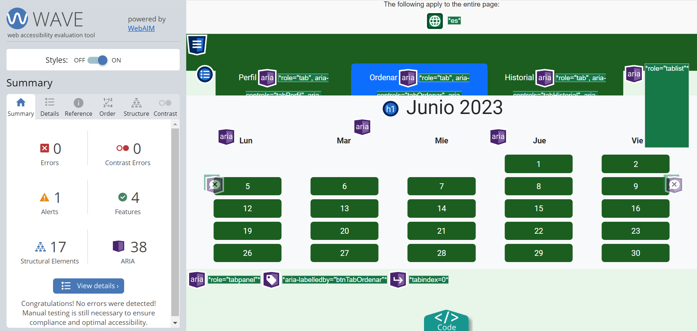
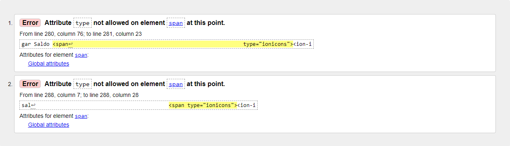

# Informe entrega 2

## Construcción

En cuanto a la implementación de nuestro proyecto, debido al tiempo acotado que disponíamos se decidió centrar el trabajo en los requerimientos orientados a los responsables de los comensales, y no al personal de la cantina que también son potenciales usuarios de la aplicación.   
La aplicación se dividió en tres secciones principales en búsqueda de una mayor organización y claridad (Perfil, Orden e Historial). A continuación se listaran las funcionalidades implementadas en cada una de ellas según la definición de requerimientos encontrada en el "informe1":    

**Apartado Perfil:** Aquí se encontrarán todas las funcionalidades relacionadas al responsable, como la lista de comensales asociados a su cuenta y el saldo que dispone en ese momento.    

- RF#4º - Agregar **comensales** : En cuanto a la implementación de este apartado, en el "informe1" se planteó la disponibilidad de una base de datos con todos los estudiantes registrados en la misma, teniendo que el responsable simplemente ingresar el número de cédula del comensal y este último pasaría a estar asociado a su cuenta. Al no disponer de dicha base de datos, se optó por realizar una ventana modal contando con un un input de texto para el nombre del comensal y un input numérico para la cédula del mismo, esta vez el responsable teniendo que ingresar los datos para que el comensal quede asociado a la cuenta.
    

- RF#12º-A Cargar **saldo** : Se realizó una ventana modal con un input numérico donde el responsable puede ingresar el saldo que quiere agregar a su cuenta.

**Apartado Ordenar:** Aquí se encuentra el calendario con los menús disponibles durante todo un mes y todas las funcionalidades relacionadas a la compra de un menú. Se decidió fijar el mes de junio 2023 como una "mes ficticio" para facilitar la implementación de dicho calendario. También se dispone de la posibilidad de ver los menús disponibles para el mes siguiente (en nuestro caso julio 2023) abogando por una posible planeación en la compra de menús.    

- RF#7º-A Ver **calendario** : Se utilizó un calendario ya predefinido en un repositorio de git hub, adaptandolo a las necesidades planteadas en los requerimientos. Se quitaron los sábados y domingos ya que no van a haber menús disponibles para dichos días y se ignoraron posibles feriados durante la semana de lunes a viernes. 

- RF#8º-A Ver **menú del día**, RF#6º- Ver **valor nutricional**, RF#9º-A Comprar **menú** : Todos estos requerimientos se pueden encontrar envueltos dentro de dos ventanas modales. Luego de seleccionar un día dentro del calendario, se despliega una ventana donde el responsable puede seleccionar dos opciones de menú distintas para un mismo día; ver el valor nutricional de dichos productos, los cuales suponemos disponibles gracias al personal de la cantina; el precio del menú y el saldo disponible. Al presionar el botón aceptar se dirige a una nueva ventana donde puede elegir a que responsable comprar un menú y se despliega información que consideramos importante en ese momento, como opción de menú seleccionada y precio y saldo nuevamente.

---

---

**Apartado Historial:** Aquí se dispone de dos listas de pedidos, una para los pedidos pendientes y otra para los completados. La lista de pedidos completados unicamente tiene como función mostrar la información de dicho menú, sin embargo, la lista de pedidos pendientes dispone de dos funcionalidades importantes además de la información mostrada. Se permite la cancelación de un pedido, la cuál lo quitará de la lista, y la opción de pagarlo, la cuál lo moverá a la lista de completados. Esta última función fue agregada para dar un cierto nivel de dinamismo a la lista de pendientes, realmente el personal de la cantina es la entidad responsable de mover un pedido de la lista pendientes a completados. 

- RF#13º-A Ver **Historial de consumo anterior** 
- RF#14º-A Ver **Historial de consumo pendiente**
- RF#15º-M Cancelar compra de **menú pendiente**

---

---

## Interfaz de usuario

Para la interfaz de usuario nos basamos en gran parte del prototipado a papel que creamos en la primer parte del curso y que se encuentra subido en formato de imagenes en la carpeta [Bocetos v1](../imagenes/Bocetos%20UI%20v1) y [Bocetos v2](../imagenes/Bocetos%20UI%20v2/), aunque lo fuimos adaptando de acuerdo a nuestros recursos y necesidades.

Fue creada utilizando mayormente funciones pre-definidas de Bootstrap como los Tabs para el movimiento entre secciones y los dialog para las acciones que requieran el ingreso de datos, todo esto para lograr un buen nivel de responsividad y, segun la especificación de estilo proporcionada por el cliente, se utilizó como color primario el verde 900, como color secundario light blue 800, el estilo de fuente es Roboto y los iconos son Filled.

A la hora de crearla nos enfocamos en que sea un sitio amistoso y facil de utilizar, está diseñado para mantener al usuario informado de la situación en la que se encuentra ya sea que cometa un error o realice efectivamente una acción. El mismo tambien cumple con el estandar de accesibilidad WCAG segun la herramienta WAVE (web accesibility evaluation tool) la cual no encontró ningun error de código ni contraste. También, la interfaz fue sometida al "Markup Validation Service" de W3C, encontrando dos errores que no fue posible solucionarlos por falta de tiempo.

---

---

El sitio esta dividido en tres secciones independientes que se pueden acceder mediante botones referenciados a cada una llamados 'Perfil', 'Ordenar' e 'Historial'.

En la sección Perfil se encuentra la informacion asociada al Responsable como el saldo y sus comensales a cargo, así como sus respectivos metodos para cargar saldo y agregar comensales.
  -El método cargar saldo se muestra como una ventana con un campo de texto que acepta valores numéricos donde ingresar la cantidad de saldo a asignar.
  -El método agregar comensales se muestra como una ventana con un campo de texto donde ingresar el nombre del      comensal y un campo de texto que acepta valores numericos donde ingresar la cedula del comensal.

En la sección Ordenar se visualiza un calendario con los dias de lunes a viernes de Junio y Julio en los que en cada uno se pueden ver las opciones de menu asignados a ese dia y realizar el pedido.
  -Los menus se visualizan en una ventana donde se muestra la informacion del menu seleccionado y un boton para confirmar el pedido

En la sección 'Historial' se muestran dos listas con cada pedido pendiente o completado, los mismos pueden ser seleccionados y se mostrara la informacion de lo que se consumio/consumira por el comensal asignado en el dia especificado.
  -Cada pedido se muestra en una ventana con la informacion del menu que se consumio/consumira y el comensal asignado. En el caso de los pedidos pendientes se incluye un boton para cancelar el pedido y otro para pagar el pedido y que el mismo pase de pendiente a completado.

---

### Aspectos a mejorar en la interfaz:

Algunos aspectos a mejorar dentro de la interfaz son la utilización de muchas ventanas modales, lo cual dificulta el flujo de uso de la aplicación para los usuarios. Debido a la etapa avanzada en la que nos dimos cuenta de este problema, no fue posible revertir la implementación que ya habíamos hecho. A su vez, faltó brindar feedback al usuario en algunas tareas como por ejemplo al comprar un menú. Para tranquilidad del usuario sería recomendable mostrar un mensaje de confirmación de que se pudo comprar su menú, o en otro caso, uno de error con la explicación pertinente.

---

## Codificación

Para la codificación de este proyecto utilizamos el IDE Visual Studio Code. Es la primera vez que utilizamos este IDE por lo que ninguno tenia una configuracion personal. Dado esto se utilizo mayormente la configuracion por defecto de Visual Studio excepto por las indentaciones que cambiamos de tabulaciones de 4 a espacios de 2.

El estandar de codificacion seleccionado fue el de google, ya que fue el designado previamente en clase. Se aseguró que este estandar fuese cumplido correctamente a través del uso de ESLint, un linter para JavaScript que es instalado a travez de Node.js. El ESLint controla que se respete el estandar de Google pero en el archivo .eslintrc.cjs es posible modificar algunas reglas para que sea mas sencillo de utilizar. Dicho esto, en 'rules' se pueden desactivar reglas que consideramos innecesarias. Las regals desactivadas para la globalidad del proyecto fueron las siguientes.

En el archivo main.js se desactivó la regla camelcase por un error inicial pero nos mantuvimos en el estandar de las camelcase dentro del main.js de cualquier forma.

Por ultimo la importancia de las buenas practicas de OOP fueron tomadas en cuenta y se pueden ver claramente dentro de [la carpeta interface](../src/interface/) y [la carpeta domain](../src/domain/). Dentro de la carpeta interface se encuentra toda la interaccion del usuario con nuestro programa. [El archivo de html](../src/interface/index.html) y [el archivo css](../src/interface/style.css) estan allí además del [archivo main.js](../src/interface/main.js). Por otro lado, dentro del domain esta el [archivo de sistema](../src/domain/sistema.js), las distinatas clases de nuestro dominio las cuales son: 

- [Comensal](../src/domain/comensal.js)
- [Menu](../src/domain/menu.js)
- [Pedido](../src/domain/pedido.js)
- [Responsable](../src/domain/responsable.js)

Además, tambien esta [el archivo claseCargaDatos](../src/domain/claseCargaDatos.js) que tiene varios datos cargados por defecto.

---

### Aspectos a mejorar en la codificación:

Luego del code freeze y analizando como nos quedó el poryecto encontramos algunos puntos que requieren de un mejor trabajo. Primeramente, muchos de los métodos que utilizamos en el archivo "Main" no son atómicos o lo más atómicos que podrían ser, realizando distintas tareas en un solo método. Además, ligado a ese problema, están los nombres poco nemotécnicos de esas funciones. Hubiera sido bueno agregar comentarios explicando que hacen cada una de ellas, pero no fue posible gracias al poco tiempo disponible.

Otro apartado en el que definitivamente se puede realizar una mejor labor es en el calendario. El mismo fue creado de forma manual y estática para simular la funcionalidad de un calendario real en las fechas que nos interesaban. Ignoramos la posibilidad de días especiales como feriados, los cuales son una realidad para todas las instituciones 

---

### Errores conocidos:

A continuación una lista de errores que fueron identificados durante la codificación pero que no pudieron ser solucionados:
- Anclar icono de cruz a la parte superior de las ventanas modales al scrollear
- No fue posible ordenar los botones según fecha en ventana historial
- No fue posible controlar hasta que horario era posible cancelar un pedido según estaba previsto en la especificación (Requerimiento Funcional 15)

---

## Test unitario

Para los tests unitarios se utilizo el framework Jest. 

En los tests unitarios se tenía como objetivo principal llegar a 100% de cobertura.
En nuestro caso, se llego a 100% de 5 de las 6 clases del dominio. La sexta clase es una clase de carga de datos la cual no presenta operaciones propias por lo que se consideró innecesario realizar pruebas para esta clase. 

Dentro de estos tests los matchers que se utilizaron fueron mayormente .toBe y .toThrow para revisar que se devolviesen valores correctos y errores para los casos que coincidieran estos matchers. Otros matchers no fueron tenidos en cuenta ya que la realización de los tests fue basada en el conocimiento dado en la presentación de ayudantía. Además la falta de tiempo hizo que fuese complejo tratar de incluir otros matchers ya que no estábamos seguro de la funcionalidad de alguno de estos. El conocimiento correcto de como utilizar estos otros matchers podría habernos simplificado algunas de nuestras pruebas. No obstante se llego a la cobertura deseada y se probaron varios casos borde que podrían habernos llevados a sufrir distintos problemas.

La creación de los tests unitarios en simultaneo a la creación de los métodos de las clases de dominio nos sirvió para darnos cuenta que había algunos condicionales a los que no se entraba nunca y que dichos condicionales so podían simplificar. Además algunos de los problemas que tuvimos con nuestros tests nos sirvieron para hacer arreglos en nuestro código.

Se podrían haber realizado mas pruebas con las funciones de nuestras clases pero por un tema de tiempo solo pudimos cumplir con el objetivo de 100% de cobertura.

---

## Reflexión

Detalle del trabajo Individual: 

A continuación se presenta un esquema aproximado del tiempo invertido en el projecto con una muy breve definicion de lo implementado. Cabe aclarar que las veces que se repite un dia es por dos posibles motivos, o se abarcaron funciones distintas en distintos momentos o se trabajo de forma separada entre el equipo.

- Inicio en la creacion del HMTL / Lautaro Elosegui aproximadamente 2 horas / 26/05/2023
- Continuacion en la creacion del HMTL / Lautaro Elosegui aproximadamente 2 horas y 30 minutos / 27/05/2023
- Implementacion de navegacion entre secciones (Tabs) / Lautaro Elosegui aproximadamente 2 horas / 03/06/2023
- Creacion de clases del dominio / Lautaro Elosegui y Santiago Pucciarelli aproximadamente 2 horas / 06/06/2023
- Primer acercamiento a js / Lautaro Elosegui aproximadamente 3 horas y 30 minutos / 07/06/2023
- Creacion ventanas modales de Saldo y Comensal / Lautaro Elosegui aproximadamente 4 horas y 30 minutos / 08/06/2023
- Creacion de objetos responsable y comensal / Lautaro Elosegui aproximadamente 1 horas / 09/06/2023
- Verificacion de entrada de Saldo / Los tres integrantes aproximadamente 4 horas / 10/06/2023
- Vinculacion de todos los dias del calendario a un mismo evento / Lautaro Elosegui y Santiago Pucciarelli aproximadamente 1 horas y 30 minutos / 12/06/2023
- Test unitario clase Comensal / Santiago Pucciarelli aproximadamente 2 horas / 13/06/2023
- Solucion de errores varios / Santiago Pucciarelli aproximadamente 2 horas / 14/06/2023
- Creacion ventana modal Menu / Lautaro Elosegui aproximadamente 2 horas / 15/06/2023
- Test unitario clase Responsable / Santiago Pucciarelli aproximadamente 1 horas / 16/06/2023
- Creacion lista comensales / Santiago Pucciarelli y Juan Andres Macedo aproximadamente 5 horas / 16/06/2023
- Asignacion de objetos Menu a su dia correspondiente / Lautaro Elosegui aproximadamente 4 horas / 17/06/2023
- Creacion ventana modal aceptar menu y lista pedidos completados / Santiago Pucciarelli y Juan Andres Macedo aproximadamente 8 horas / 17/06/2023
- Optimizacion de codigo y avance en asignacion de objetos menu a dia correspondiente / Lautaro Elosegui aproximadamente 3 horas / 18/06/2023
- Ventanas modales consumos pendientes y completados / Lautaro Elosegui aproximadamente 2 horas / 18/06/2023
- Test unitario clases Sistema y Pedido / Santiago Pucciarelli aproximadamente 2 horas / 18/06/2023
- Funcionalidad cargar pedido completado y cancelar pedido pendiente / Santiago Pucciarelli y Juan Andres Macedo aproximadamente 5 horas / 18/06/2023
- Funcionalidad pagar pedido pendiente, mensajes de error y solucion de errores. Puesta a punto para entregar / Los tres integrantes aproximadamente 4 horas / 19/06/2023

---

Finalizado el obligatorio, como equipo podemos concluir que en esta segunda parte utilizamos mucho mejor la herramienta de versionado git. Logrando realmente trabajar en paralelo, divididendo la carga de trabajo para alcanzar nuestros objetivos como equipo. A lo largo de la creación de este proyecto nos topamos con muchos altibajos debido a la poca práctica que teníamos con las herramientas necesarias para la realización del mismo y la incertidumbre de si lograríamos un resultado satisfactorio, pero este hecho nos dio, a pequeña escala, una experiencia necesaria para nuestro futuro cercano.Aprendimos a utilizar el tiempo de manera más eficiente y nos dio una perspectiva diferente de lo que es hacer un trabajo de una complejidad elevada en un tiempo acotado. Con respecto al estado final del proyecto, quedamos conformes con el resultado obtenido, no solo logramos cumplir con muchos de nuestros objetivos previamente definidos en el [informe 1](informe1.md), sino que también aprendimos sobre formas de mejorar la calidad de código como la utilización de esLint y la creación de interfaces de usuario con el Framework Bootstrap, así como el cumplimiento de estándares muy aceptados por la comunidad. Sin embargo, somos conscientes de que aún hay un enorme márgen de mejora.

---