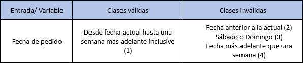
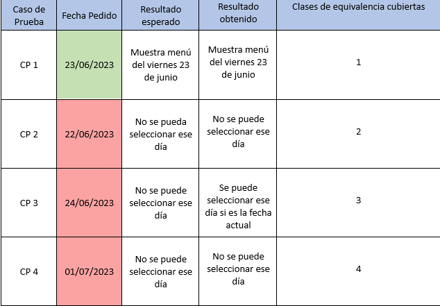

# Informe de testing 
[Proyecto asignado](https://github.com/ORT-FIS-2023S1/proyecto-giangreco-quadrelli-ribarov.git)

## Test de sistema

Para iniciar con nuestra labor de testers, decidimos realizar una sesión de testing exploratorio en conjunto para obtener una primera impresión de la página y sus funcionalidades. Tomamos distintas notas en papel en el correr de la actividad y luego las documentamos en este informe de forma más organizada y clara.   

---

**Reporte de sesión de testing exploratorio 1:**    

**Aplicación bajo prueba:** Aplicación comedor escolar de Giangreco, Quadrelli y Ribarov   

**Unidad de tiempo:** Corta (10 minutos)    

**Objetivo:** Familiarizarse con el funcionamiento de la página   

**Tester:** Juan Andrés Macedo, Santiago Pucciarelli y Lautaro Elosegui   

**Fecha:** 22/06/2023

**Notas:**
- Las pruebas se realizaron en su totalidad en el navegador Google Chrome version 114.0.5735.134 
- La aplicación inicia con una pantalla inicial en tonalidades violetas, con 5 posibles botones. Arriba a la izquierda se muestra un texto que dice "Bienvenido, Nelson", el cual suponemos es el nombre del responsable que está utilizando la aplicación. Al presionar los botones arriba a la derecha descubrimos que no cumplen ninguna función más que decorativa. 
- Presionando el botón "Menú Diario" somos dirigidos a una nueva ventana con una gran variedad de elementos. Se destacan el calendario en la parte superior, el cual esta restringido a 5 días en el mes de junio del año 2023, y las opciones de menú en el espacio sobrante de la página. Se pueden comprar menús presionando el botón "Seleccionar Menú". Sin embargo, aquí se encontró un defecto al intentar comprar diferentes menús. Si se intenta presionar encima del ícono "+" salta un error en la consola y no se puede comprar dicho menú.
- Presionando el botón "Historial" somos dirigidos a una ventana con un listado de lo que suponemos compras anteriores y recientes en un mismo contenedor. También hay un botón pagar que aún no está implementado.
- Presionando el botón "Contacto" se nos dirige a otra ventana con más botones los cuáles aún no son implementados.   
- En resúmen, de este ejercicio obtuvimos las funcionalidades implmenetadas en la aplicación: Ver menú, comprar menú y ver historial. 

---

A continuación el reporte de todos los tests exploratorio realizados por el equipo:   

**Reporte de sesión de testing exploratorio 2:**   

**Aplicación bajo prueba:** Aplicación comedor escolar de Giangreco, Quadrelli y Ribarov

**Unidad de tiempo:** Corta (30 minutos)

**Objetivo:** Encontrar problemas con la resposividad.

**Tester:** Santiago Pucciarelli.

**Fecha:** 24/06/2023

**Notas:** 
- Las pruebas se realizaron en su totalidad en el navegador Firefox 114.0.2.
- El Web Developer Toolkit de firefox presenta simulacion de Chrome y Safari para las pruebas de dispositivos moviles. Los moviles android son simulados en chrome y los moviles iOS e y iPadOS son simulados en safari.
- Se probo la pagina principal y no parece tener problemas de resposividad al testear con los dispositivos moviles por defecto del Web Developer Toolkit de Firefox.
- El unico detalle es que al poner el celular en horizontal los botones historial y contacto desaparecen.
- En menu diario por otro lado hay problemas de responsividad.
- En los celulares mas finos aparece una scrollbar para scrollear dentro de los menus, aunque no haya nada para ver si se scrollea.
- En dispositvos con aspectos mas anchos como podrian ser las tablets la imagen de la comida se coloca por detras del texto del menu.
- Este problema anterior se da en todos los dispositivos moviles al ponerlos en horizontal.
- Al poner algunas tablets en horizontal (ej: Kindle Fire HDX Linux) el contenido se ve correctamente.
- Por ultimo, en el desktop en si se ve perfectamente en pantalla completa pero si se decide tener la ventana en tamaños mas chicos se empiezan a ver los mismos problemas que se ven en tablets o celulares en horizontal.
- Este problema se daría entre relaciones de aspecto 11:9 y 5:9 aproximadamente.
- Por ultimo en el menu no hay ningun problema grande de responsividad.
- Hay un detalle menor que es que despues de cierta cantidad de compras se agrega una scrollbar al costado para scrollear por los menus comprados. El problema se presenta en que si se pone el celular en horizontal para acceder al boton pagar (no implementado) se tiene que scrollear por el menu para poder scrollear por la pantalla o hacer scroll en los lugares.
- Sentimos una molestia general con el hecho de que si se pone en horizontal el dispositivo movil hay que scrollear para acceder a los botones que se encuentran en las secciones inferiores del contenido. Esto se de en el menu principal, el historial, y el menu de contactos.
- En el menu principal el boton contacto siempre queda oculto e historial aparece en cantidades distintas dependiendo del celular.
- En el menu contacto, el boton contacto no aparece y el boton de mail aparece en cantidades distintas dependiendo del celular.
- En el menu historial se da lo del boton pagar que fue mencionado previamente.
- Un pequeño detalle final es que si se esta en horizontal, se scrollea hacia bajo y se abre un menu, el contenido que se abre esta en la misma posición que el anterior. Asumo que esto es notorio en horizontal ya que no se puede desplegar todo el contenido si no se scrollea, mientras que en los otros ratios de aspecto se puede ver sin problemas.

---

**Reporte de sesión de testing exploratorio 3:**   

**Aplicación bajo prueba:** Aplicación comedor escolar de Giangreco, Quadrelli y Ribarov

**Unidad de tiempo:** Corta (20 minutos)

**Objetivo:** Encontrar problemas con el calendario.

**Tester:** Santiago Pucciarelli.

**Fecha:** 24/06/2023

**Notas:**
- Las pruebas se realizaron en su totalidad en el navegador Firefox 114.0.2.
- Al igual que el testing de responsividad, este testing se realizo en el navegador Firefox 114.0.2.
- Para estas pruebas se tiene que ir viendo que pasa con el calendario y el historial, por lo que se va cambiando de ventanas constantemente.
- Si el dia en el que se va a realizar el pedido es un sabado o un domingo, se permite hacer un pedido para ese dia sabado o domingo aunque esten como restringidos en el calendario.
- Si se compran todos los menus un dia, en los siguientes dias no hay menus disponibles para comprar.
- Los dias que estan deshabilitados se pueden habilitar utilizando la herramienta de inspeccion del Web Developer Toolkit de Firefox.
- Descubrimos que hasta el dia 5 de Junio hay un menu llamado Churrascos de Pollo que no aparece en ningun lado.
- Cambiando la fecha del sistema, nos dimos cuenta que hay menus disponibles desde el 3 de enero de 1994 y hasta el 31 de diciembre de 2023.
- A partir del 2024, se rompe el boton del calendario.
- Si cambiamos la fecha del sistema a ser el 1 de mayo de 2024, se rompe el css (esto debe ser un problema de bootstrap).
- A partir del 7 de julio de 2023, el unico menu disponible es el de Empanadas Napolitanas, los otros desaparecen.

---

**Reporte de sesión de testing exploratorio 4:**   

**Aplicación bajo prueba:** Aplicación comedor escolar de Giangreco, Quadrelli y Ribarov

**Unidad de tiempo:** Corta (20 minutos)

**Objetivo:** Encontrar problemas con la ortografia.

**Tester:** Lautaro Elosegui.

**Fecha:** 25/06/2023

**Notas:**
- Este testing se realizo en el navegador Chrome 114.0.5735.134.
- Para esta prueba se revisara la ortografia de los distintos textos colocados en la pagina, por lo que se visitaran todos los apartados.
- En primera instancia se evaluo la ventana inicial del sitio, donde no se presento ningun problema de ortografia segun el contexto actual del mismo.
- En la ventana "Menú Diario" se puede apreciar una inconsistencia ortografica ya que en la descripcion de los menús "Empanadas napolitanas" y "Hamburguesa al pan" se utiliza un "." para separar la descripcion del menú y la funcionalidad "Ver mas", cosa que en el resto de menús esto no es asi.
- En la ventana "Menú Diario", mas especificamente en el menú "Milanesa con Puré", se puede ver que en la descripcion está escrito "acompaña de puré" en lugar de "acompañada de puré".
- En la ventana "Historial" no se aprecia ningun problema de ortografia.
- En la ventana "Contacto" no se aprecia ningun problema de ortografia.

---

**Partición de equivalencia:**

Solamente pudimos aplicar la técnica de partición de equivalencia con el campo fecha, siendo el único donde el usuario puede ingresar una entrada. Sin embargo, al este campo estar restringido, decidimos cambiar la fecha del sistema para intentar evaluar el comportamiento de dicha funcionalidad en distintas fechas.

---

---

## Reporte de issues

En cuanto al reporte de issues como equipo y tomando en cuenta las limitaciones al no poder editar las labels que vienen por defecto con git por ejemplo (probablemente por los roles), decidimos que los issues tendrán la siguiente estructura:   

**Titulo:** -   

**Ambiente:** -   

**Descripción:** -

**Etiqueta:** 
- Bug (Bug): Para problemas relacionados con errores o fallos en la aplicación.
- Mejora (Enhancement): Para posibles mejoras o nuevas funcionalidades en la aplicación.
- Diseño (Invalid): Para problemas relacionados con el diseño visual, la usabilidad y accesibilidad de la interfaz.   

**Severidad:**
- Baja: Para problemas menores que no afectan significativamente la funcionalidad o la experiencia del usuario.
- Media: Para problemas que tienen un impacto moderado en la funcionalidad o la experiencia del usuario.
- Alta: Para problemas críticos que afectan gravemente la funcionalidad o la experiencia del usuario y requieren una solución urgente.
- Bloqueante: Para problemas que impiden por completo el uso de la aplicación y requieren una solución inmediata.

**Datos de prueba:** -    

**Pasos a reproducir:** -    

**Resultado esperado:** -    

**Resultado obtenido:** -   

---

## Informe de calidad del sistema

### Resumen de issues más relevantes:  
- Bug - Severidad Bloqueante - Fallo al presionar el icono "+" al comprar un menú
- Bug - Severidad Bloqueante - Desaparición total de opciones de Menú
- Mejora - Botón cancelar
- Bug - Severidad Alta - Fecha pedido y compra se modifican en base a la fecha del sistema
- Diseño - Severidad Alta - Texto queda por delante de imagenes perdiendo contraste
- Diseño - Severidad Alta - Problema con la especificación de estilo
- Diseño - Severidad Alta - Seguimiento de la especificación de estilo - Fuente

### Cantidad de issues según etiqueta:
- Bug: 3
- Mejora: 5
- Diseño: 15

### Cantidad issues según severidad:
- Bloqueante: 2
- Alta: 5
- Media: 4
- Baja: 7

Realizada la actividad de testing, podemos concluir los aspectos más fuertes y débiles, según nuestro criterio, de la aplicación. Para empezar, creemos que la accesibilidad y portabilidad son los aspectos en donde el sistema destaca, logra adaptarse bien a las distintas pantallas que podrían utilizar los usuarios. Los issues que fueron reportados en ese apartado en general fueron de severidad baja, siendo el único de severidad alta el issue "Texto queda por delante de imagenes perdiendo contraste", el cual puede ser visto en algunos modelos de celulares con pantallas pequeñas y haciendo que la descripción del menú sea ilegible. En cuanto a accesibilidad no encontramos errores con la herramienta "Wave". Sin embargo, al abordar los aspectos de funcionalidad y usabilidad es donde el sistema posee la mayor cantidad de aspectos a mejorar. Fueron implementadas las funciones mínimas necesarias, siendo ver menú, seleccionar menú y ver historial. No obstante, asociados a esas funcionalidades existen issues de severidad bloqueante que no permiten un correcto flujo de la app. Dichos issues deben ser tratados inmediatamente. Además, se plantearon por lo menos tres mejores relacionadas al manejo de los menús que le darían un mayor valor al usuario en cuanto al uso del sistema. Finalmente, otro aspecto no considerado fue la especificación del cliente en cuanto al estilo general de la aplicación, siendo extremadamente importante acatar con las instucciones que se nos fueron dadas.

---

## Reflexión

Detalle del trabajo Individual:   

- Reconocimiento de la página / Llamada entre los tres integrantes aproximadamente 2 horas / 22/06/2023
- Sesión de testing exploratorio responsividad / Santiago Pucciarelli aproximadamente 40 minutos / 24/06/2023
- Sesión de testing exploratorio problemas con fechas/ Santiago Pucciarelli aproximadamente 1 hora / 24/06/2023
- Creación de Tablas de partición de equivalencia / Juan Andrés Macedo aproximadamente 40 minutos / 24/06/2023
- Sesión de testing exploratorio ortografía / Lautaro Elosegui aproximadamente 30 minutos / 25/06/2023
- Documentación de issues / LLamada entre los tres integrantes aproximadamente 1 hora / 25/06/2023 
- Reporte Issues gitHub / Los tres integrantes participaron aprox 5 horas / 26/06/2023 
- Informe calidad del sistema / LLamada entre los tres integrantes aproximadamente 1 hora / 26/06/2023

---

Reflexión Juan Andrés Macedo: Siendo totalmente honesto, la parte de testing fue la que menos disfruté de todo el proyecto, tal vez la razón sea la cercanía temporal a otras evaluaciones y el momento del año en que nos encontramos. Sin embargo tengo que reconocer que el testing es unos de los pilares dentro del mundo del software, por lo que se valora haber tenido un mínimo acercamiento a la materia.

---

Reflexión Lautaro Elosegui: Debido a que el proyecto se planteo de una forma abierta, es inevitable que cada equipo lo abarque de manera distinta y cada uno tendra un nivel de profundidad diferente, esto nos complico a la hora de hacer el testing ya que nos brindaba pocas herramientas para realizar ciertos tests orientados a la interfaz de usuario, como el de particion por equivalencia, etc. Aun asi considero que hicimos un trabajo de un nivel acorde al que se esperaba, utilizando tecnicas de testing correctas y precisas segun lo aprendido en el curso. 

---

Reflexión Santiago Pucciarelli: Me hubiese gustado que el proyecto que nos tocó tuviese un poco más de profundidad, ya que no sentí que hubiese muchas cosas para probar. Esto siento que nos complicó a la hora de poder organizarnos y separar las tareas individualmente. De cualquier forma creo que hicimos un buen trabajo, teniendo en cuenta lo poco que podiamos probar sin tocar el codigo fuente.
